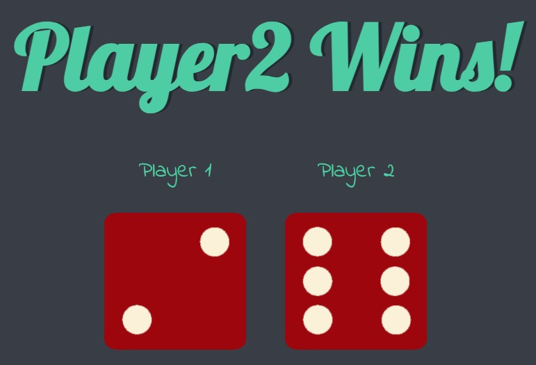

# Web Development Bootcamp - Project_TheDiceeGame

Final Project of Intermediate JavaScript and DOM.

## Table of contents

- [Overview](#overview)
  - [Screenshot](#screenshot)
  - [Links](#links)
- [My process](#my-process)
  - [Built with](#built-with)
  - [Useful resources](#useful-resources)

## Overview

### Screenshot

### Links

- Live Site URL: https://mateusz-przybyla.github.io/JS-TheDiceeGame/

## My process

### Built with

- JavaScript: querySelector(), setAttribute(), Math.random(), Math.floor(), Math.ceil() methods, window.onload

### Useful resources

- [Web Development Bootcamp](https://www.udemy.com/course/the-complete-web-development-bootcamp/?couponCode=KEEPLEARNING) - The Web Development Bootcamp in which I am taking part.
- [MDN Web Docs](https://developer.mozilla.org/en-US/) - My best website which help me understand rules and features about HTML, CSS and JS languages.
- [Kurs JavaScript dla superbohaterów](https://kursjs.pl/)
